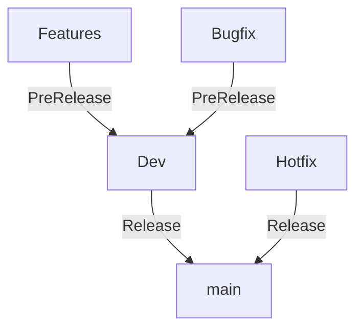

# Contributing

Please check out common DSC Community [contributing guidelines](https://dsccommunity.org/guidelines/contributing).

## Running the Tests

If want to know how to run this module's tests you can look at the [Testing Guidelines](https://dsccommunity.org/guidelines/testing-guidelines/#running-tests)

## Branch Model

The branch model is based on the [GitFlow](https://nvie.com/posts/a-successful-git-branching-model/) model.



## GitVersion install

```powershell
    #eventually you need to install the nuget.org source
    #dotnet nuget add source https://api.nuget.org/v3/index.json -n nuget.org

    dotnet tool install --global GitVersion.Tool --version 5.12.0
```

## Manual Build, Import & Connect

```powershell
    # Clone the repository
    ./build.ps1 -Tasks build
    $version = (dotnet-gitversion.exe /showvariable MajorMinorPatch)
    $ModuleFile = ".\output\module\Notion\$version\Notion.psd1"
    Import-Module $ModuleFile
    # Import-Module Microsoft.PowerShell.PlatyPS -Force
    # New-MarkdownCommandHelp -ModuleInfo (Get-Module Notion) -OutputFolder .\docs -WithModulePage -HelpVersion "$version" -Force
    $BearerToken = Read-Host -Prompt "Enter your Notion Bearer Token" -AsSecureString

    Connect-Notion -BearerToken $BearerToken
```
