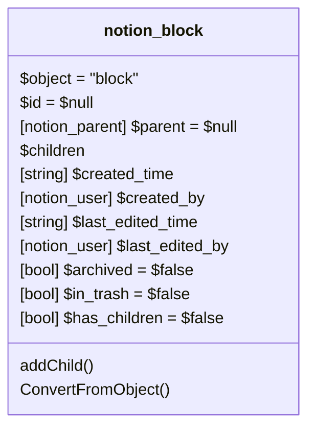
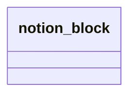

# Block: Block

[API Reference](https://developers.notion.com/reference/block)

## Related Classes

- [notion_parent](../Parent/00_parent.md)

## Derived blocks

Other block types are inherited from the generic block.

* [Bookmark](./05_Bookmark.md)
* [Breadcrumb](./06_Breadcrumb.md)
* [Bulleted_List_Item](./07_Bulleted_List_Item.md)
* [Callout](./08_Callout.md)
* [Child_Database](./09_Child_Database.md)
* [Child_Page](./10_Child_Page.md)
* [Code](./11_Code.md)
* [Column](./12_Column.md)
* [Column_List](./13_Column_List.md)
* [Divider](./14_Divider.md)
* [Embed](./15_Embed.md)
* [Equation](./16_Equation.md)
* [Heading](./17.1_Heading.md)
* [Image](./21_Image.md)
* [Link_Preview](./21_Link_Preview.md)
* [Numbered_List_Item](./22_Numbered_List_Item.md)
* [Paragraph](./23_Paragraph.md)
* [File_block](./23.1_File_block.md)
* [PDF](./24_PDF.md)
* [Quote](./25_Quote.md)
* [Synced_Block](./26_Synced_Block.md)
* [Table](./27.99_Table.md)
* [Table_Of_Contents](./30_Table_Of_Contents.md)
* [To_do](./31_To_do.md)
* [Toggle](./32_Toggle.md)
* [Video](./33_Video.md)

Within these blocks a inheritance will only visible as class element without all properties.

