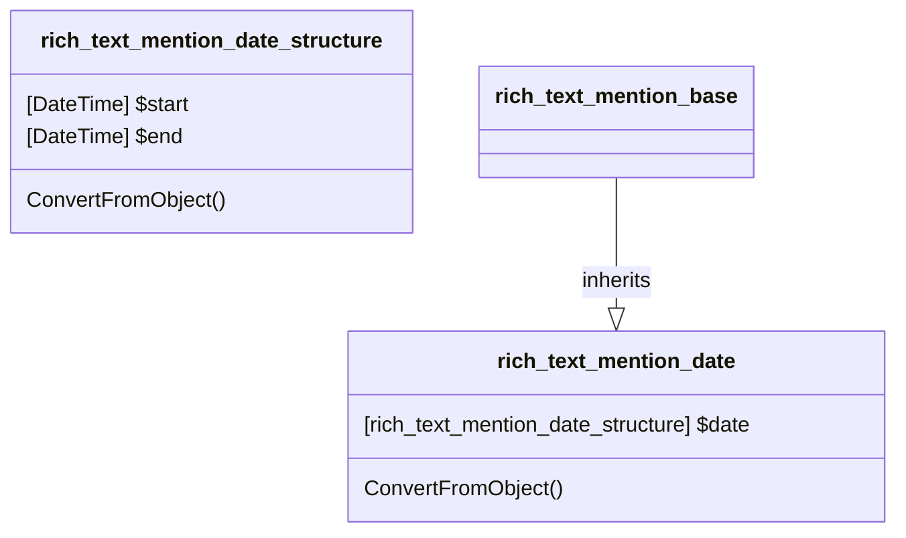

# Rich_Text: Mention: Date

[API Reference](https://developers.notion.com/reference/rich-text#mention)

```mermaid
classDiagram
    class rich_text_mention_date_structure {
        [DateTime] $start
        [DateTime] $end
        ConvertFromObject()
    }

    class rich_text_mention_date {
        [rich_text_mention_date_structure] $date
        ConvertFromObject()
    }
    `rich_text_mention_base` --|> `rich_text_mention_date`:inherits
```
