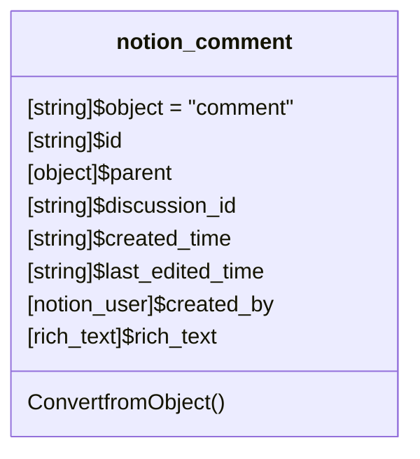

# Comment

[API Reference](https://developers.notion.com/reference/comment-object)

```mermaid
classDiagram
    class notion_comment {
        [string]$object = "comment"
        [string]$id
        [object]$parent
        [string]$discussion_id
        [string]$created_time
        [string]$last_edited_time
        [notion_user]$created_by
        [rich_text]$rich_text
        ConvertfromObject()
    }
```
