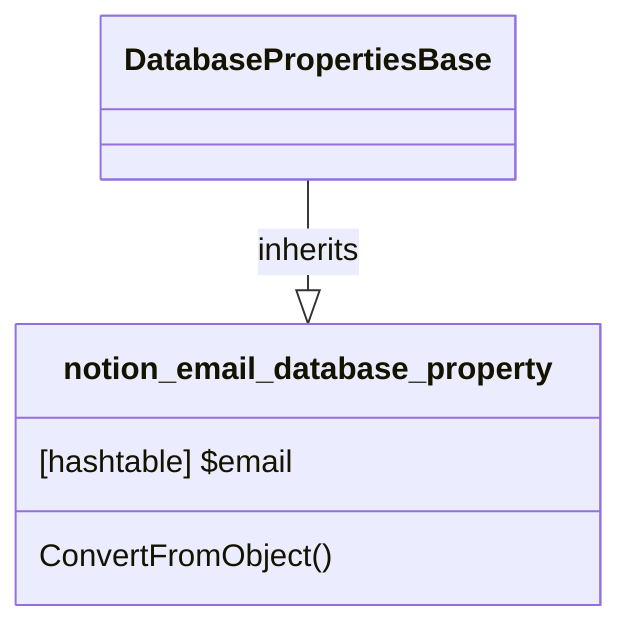

# DatabaseProperty: Email

[API Reference](https://developers.notion.com/reference/property-object#email)

```mermaid
classDiagram
    class notion_email_database_property {
        [hashtable] $email
        ConvertFromObject()
    }
    `DatabasePropertiesBase` --|> `notion_email_database_property`:inherits
```

## Related Classes

- [DatabasePropertiesBase](./00_dp_DatabasePropertiesBase.md)
