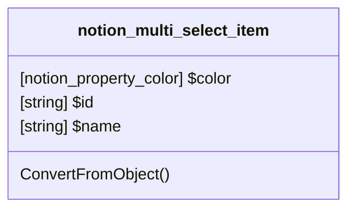

# PageProperty: Multi_select_item

[API Reference](https://developers.notion.com/reference/property-object#multi-select)

If the type of a page property value is "multi_select", then the property value contains a "multi_select" array.

