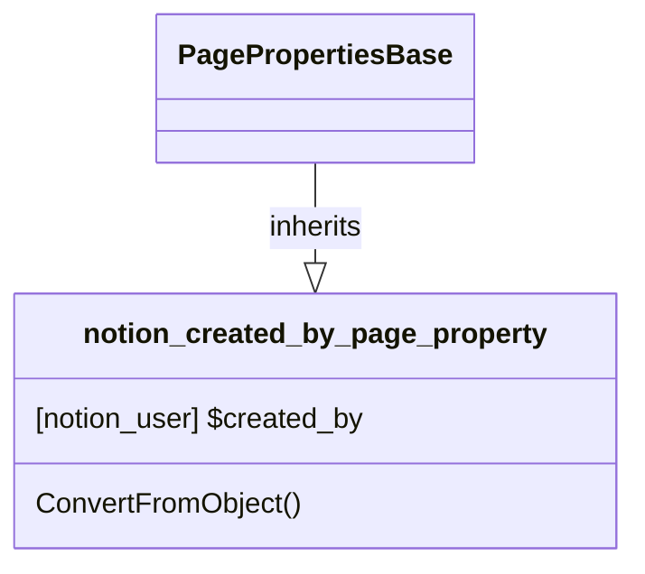

# PageProperty: Created_by

[API Reference](https://developers.notion.com/reference/page-property-values#created-by)

## Related Classes

- [notion_user](../../User/01_user.md)
- [PagePropertiesBase](./00_pp_base.md)
