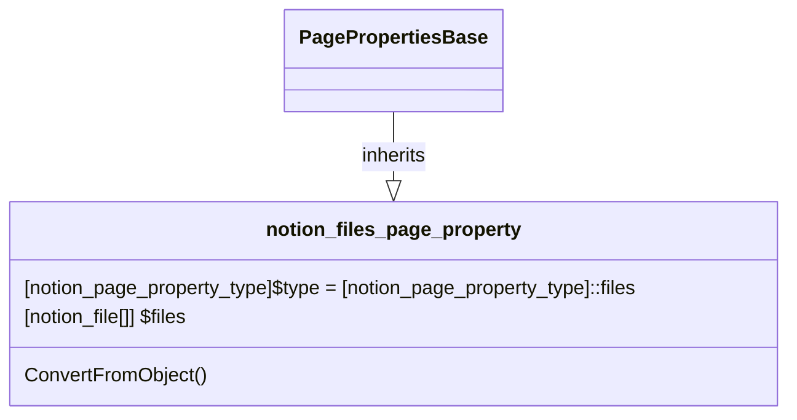

# PageProperty: Files

[API Reference](https://developers.notion.com/reference/page-property-values#files)

```mermaid
classDiagram
    class notion_files_page_property {
        [notion_page_property_type]$type = [notion_page_property_type]::files
        [notion_file[]] $files
        ConvertFromObject()
    }
    `PagePropertiesBase` --|> `notion_files_page_property`:inherits
```

## Related Classes

- [PagePropertiesBase](./00_pp_base.md)
