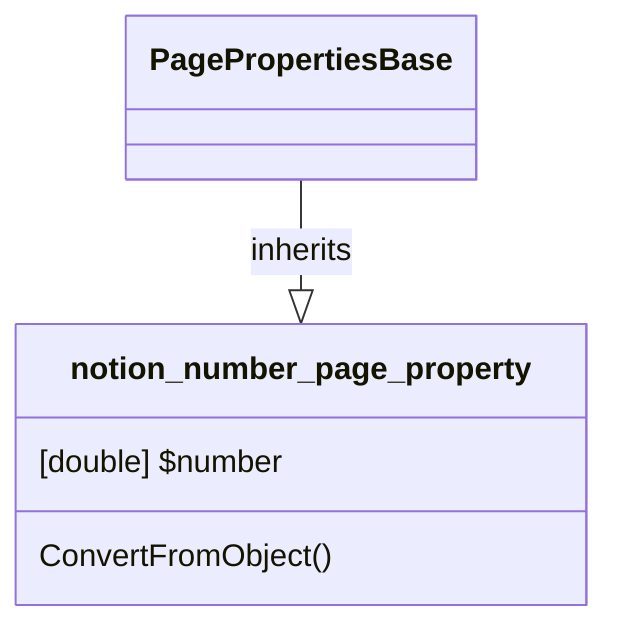

# PageProperty: Number

[API Reference](https://developers.notion.com/reference/page-property-values#number)

```mermaid
classDiagram
    class notion_number_page_property {
        [double] $number
        ConvertFromObject()
    }
    `PagePropertiesBase` --|> `notion_number_page_property`:inherits
```

## Related Classes

- [PagePropertiesBase](./00_pp_base.md)
