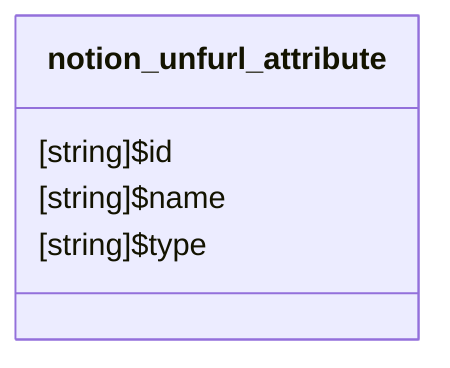

# Unfurl attribute

[API Reference](https://developers.notion.com/reference/unfurl-attribute-object)

```mermaid
classDiagram
    class notion_unfurl_attribute {
        [string]$id
        [string]$name
        [string]$type
    }
```

## TODO
