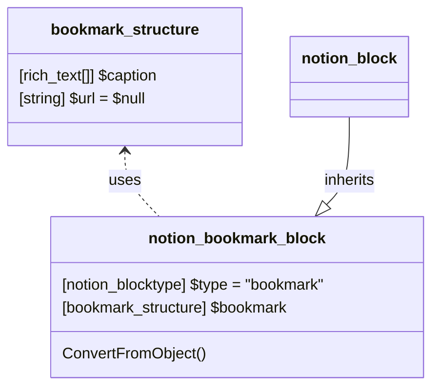

# Block: Bookmark

[API Reference](https://developers.notion.com/reference/block#bookmark)

```mermaid
classDiagram
   class bookmark_structure{
        [rich_text[]] $caption
        [string] $url = $null
   }
    class notion_bookmark_block {
        [notion_blocktype] $type = "bookmark"
        [bookmark_structure] $bookmark
        ConvertFromObject()
    }
    `bookmark_structure` <.. `notion_bookmark_block`:uses
    `notion_block` --|> `notion_bookmark_block`:inherits
```

## TODO: bookmark_structure misses  ConvertFromObject()
