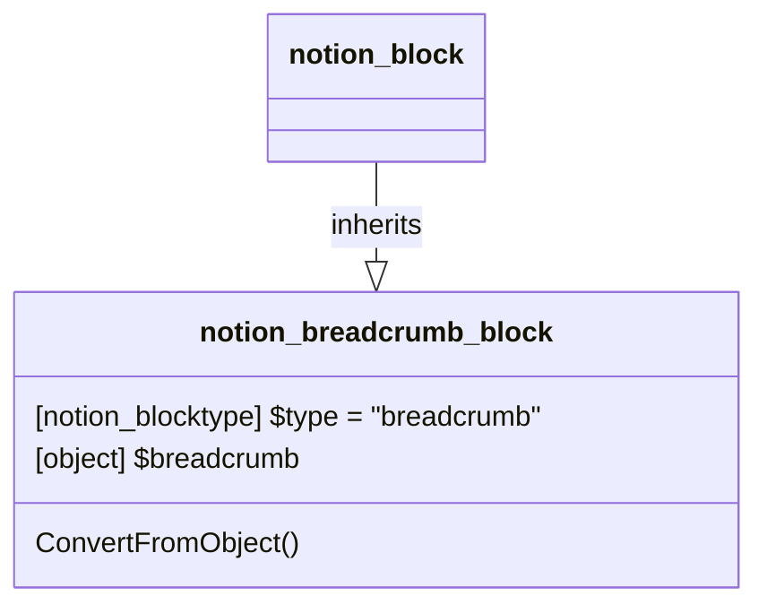

# Block: Breadcrumb

[API Reference](https://developers.notion.com/reference/block#breadcrumb)

```mermaid
classDiagram
    class notion_block:::styleClass

    class notion_breadcrumb_block {
        [notion_blocktype] $type = "breadcrumb"
        [object] $breadcrumb 
        ConvertFromObject()
    }
    `notion_block` --|> `notion_breadcrumb_block`:inherits
```
