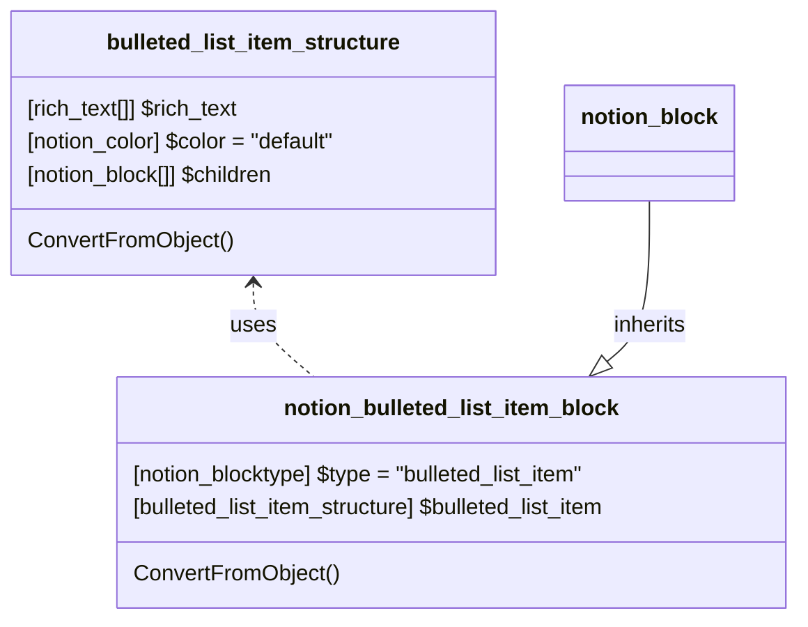

# Block: Bulleted_List_Item

[API Reference](https://developers.notion.com/reference/block#bulleted-list-item)

```mermaid
classDiagram
    class bulleted_list_item_structure {
        [rich_text[]] $rich_text
        [notion_color] $color = "default"
        [notion_block[]] $children
        ConvertFromObject()
    }

    class notion_bulleted_list_item_block {
        [notion_blocktype] $type = "bulleted_list_item"
        [bulleted_list_item_structure] $bulleted_list_item
        ConvertFromObject()
    }
    `bulleted_list_item_structure` <.. `notion_bulleted_list_item_block`:uses
    `notion_block` --|> `notion_bulleted_list_item_block`:inherits
```
