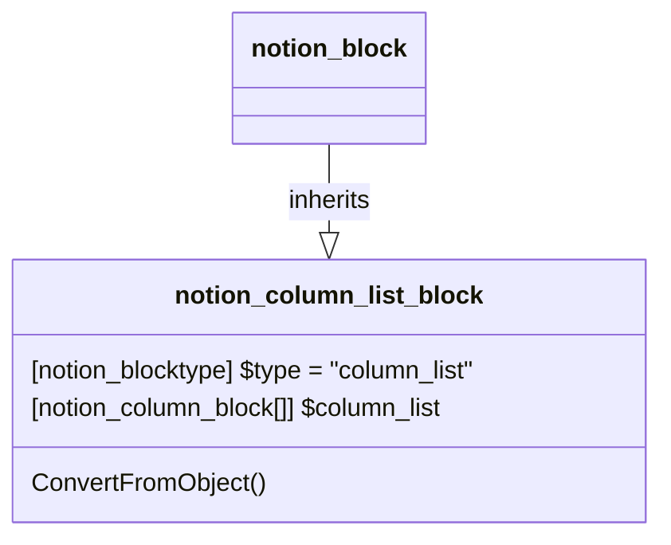

# Block: Column_List

[API reference](https://developers.notion.com/reference/block#column-list-and-column)

```mermaid
classDiagram
    class notion_column_list_block {
        [notion_blocktype] $type = "column_list"
        [notion_column_block[]] $column_list
        ConvertFromObject()
    }
    `notion_block` --|> `notion_column_list_block`:inherits
```
