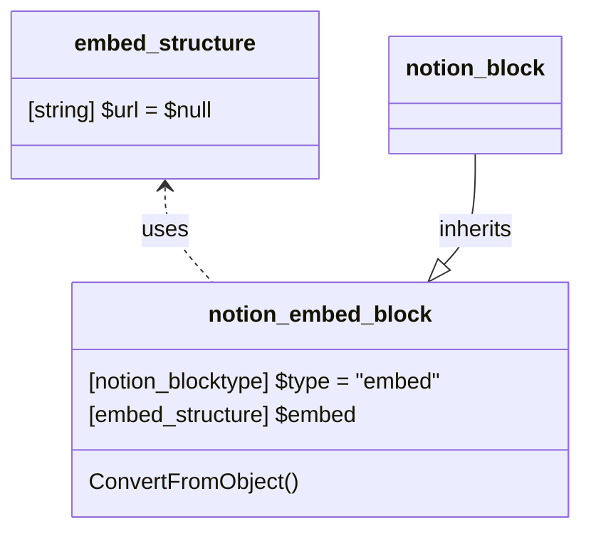

# Block: Embed

[API reference](https://developers.notion.com/reference/block#embed)

```mermaid
classDiagram
    class embed_structure {
        [string] $url = $null    
    }
    
    class notion_embed_block {
        [notion_blocktype] $type = "embed"
        [embed_structure] $embed
        ConvertFromObject()
    }
    `embed_structure` <.. `notion_embed_block`:uses
    `notion_block` --|> `notion_embed_block`:inherits
```
