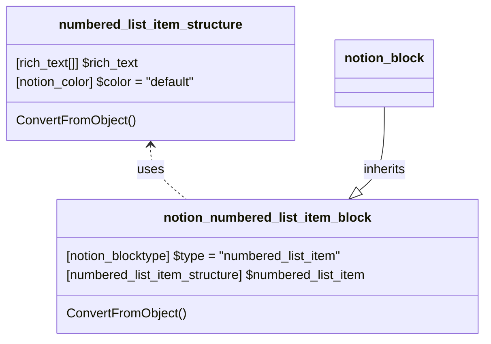

# Block: Numbered_list_item

[API reference](https://developers.notion.com/reference/block#numbered-list-item)

```mermaid
classDiagram
    class numbered_list_item_structure {
        [rich_text[]] $rich_text
        [notion_color] $color = "default"
        ConvertFromObject()
    }
    class notion_numbered_list_item_block {
        [notion_blocktype] $type = "numbered_list_item"
        [numbered_list_item_structure] $numbered_list_item
        ConvertFromObject()
    }
    `numbered_list_item_structure` <.. `notion_numbered_list_item_block`:uses
    `notion_block` --|> `notion_numbered_list_item_block`:inherits
```
