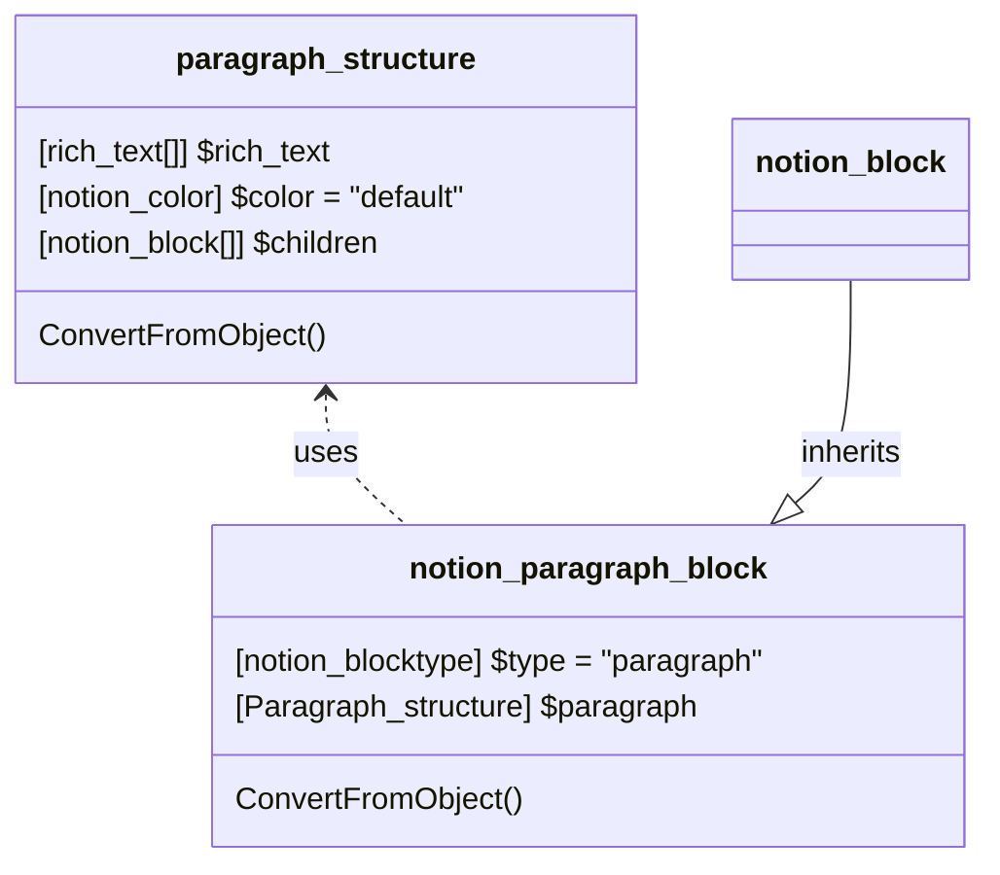

# Block: Paragraph

[API reference](https://developers.notion.com/reference/block#paragraph)

```mermaid
classDiagram
    class paragraph_structure {
        [rich_text[]] $rich_text
        [notion_color] $color = "default"
        [notion_block[]] $children
        ConvertFromObject()
    }
    
    class notion_paragraph_block {
        [notion_blocktype] $type = "paragraph"
        [Paragraph_structure] $paragraph
        ConvertFromObject()
    }
    `paragraph_structure` <.. `notion_paragraph_block`:uses
    `notion_block` --|> `notion_paragraph_block`:inherits
```
