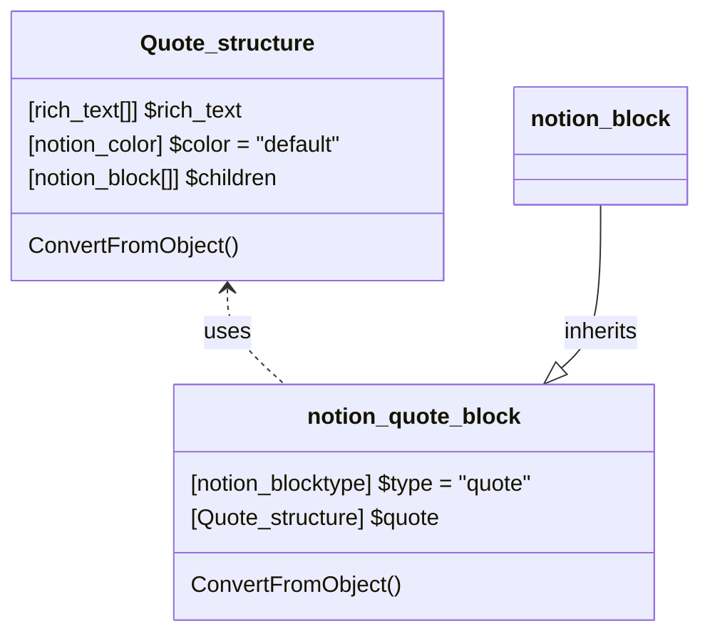

# Block: Quote

[API reference](https://developers.notion.com/reference/block#quote)

```mermaid
classDiagram
    class Quote_structure {
        [rich_text[]] $rich_text
        [notion_color] $color = "default"
        [notion_block[]] $children
        ConvertFromObject()
    }

    class notion_quote_block {
        [notion_blocktype] $type = "quote"
        [Quote_structure] $quote
        ConvertFromObject()
    }
    `Quote_structure` <.. `notion_quote_block`:uses
    `notion_block` --|> `notion_quote_block`:inherits
```
