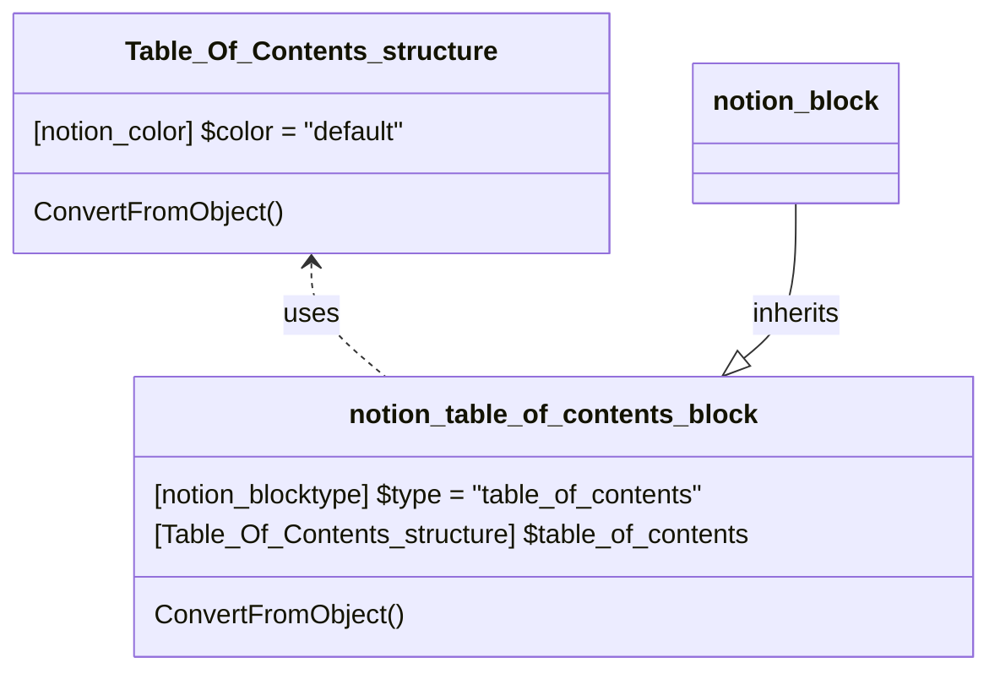

# Block: Table_of_content

[API reference](https://developers.notion.com/reference/block#table-of-contents)

```mermaid
classDiagram
    class Table_Of_Contents_structure {
        [notion_color] $color = "default"
        ConvertFromObject()
    }

    class notion_table_of_contents_block {
        [notion_blocktype] $type = "table_of_contents"
        [Table_Of_Contents_structure] $table_of_contents
        ConvertFromObject()
    }
    `Table_Of_Contents_structure` <.. `notion_table_of_contents_block`:uses
    `notion_block` --|> `notion_table_of_contents_block`:inherits
```
