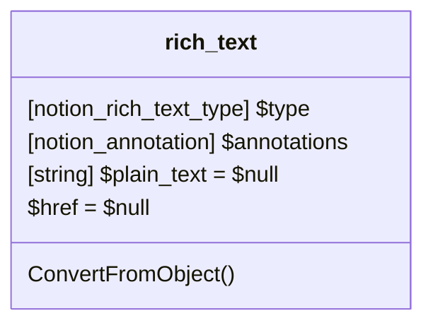

# Rich_text

[API Reference](https://developers.notion.com/reference/rich-text)

```mermaid
classDiagram
    class rich_text {
        [notion_rich_text_type] $type
        [notion_annotation] $annotations
        [string] $plain_text = $null
        $href = $null
        ConvertFromObject()
    }   
```
