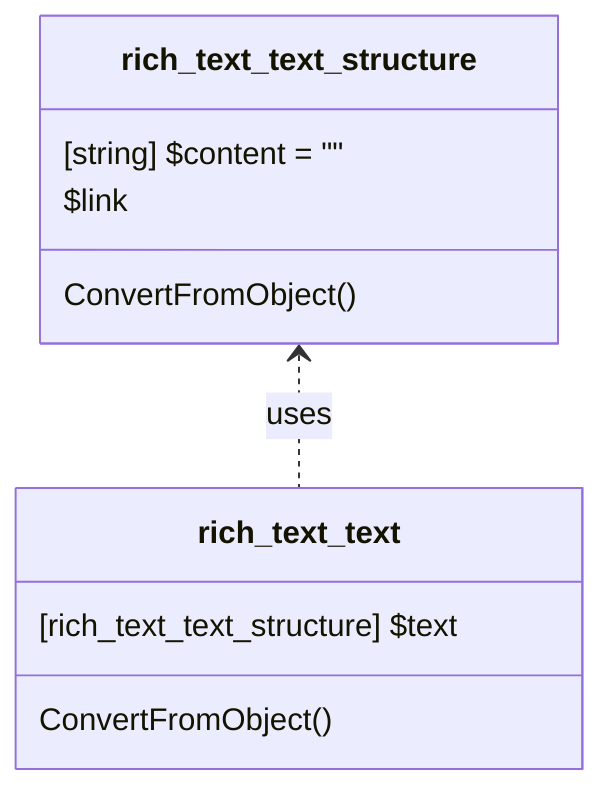

# Rich_text: Text 

[API Reference](https://developers.notion.com/reference/rich-text#text)

```mermaid
classDiagram
    class rich_text_text_structure {
        [string] $content = ""
        $link
        ConvertFromObject()
    }

    class rich_text_text {
        [rich_text_text_structure] $text
        ConvertFromObject()
    }
    `rich_text_text_structure` <.. `rich_text_text`:uses
```
