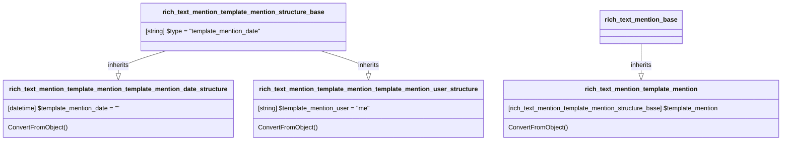

# Rich_Text: Mention: Page

[API Reference](https://developers.notion.com/reference/rich-text#mention)

```mermaid
classDiagram
    class rich_text_mention_template_mention_structure_base {
        [string] $type = "template_mention_date"
    }

    class rich_text_mention_template_mention_template_mention_date_structure {
        [datetime] $template_mention_date = ""
        ConvertFromObject()    
    }

    class rich_text_mention_template_mention_template_mention_user_structure {
        [string] $template_mention_user = "me"
        ConvertFromObject()
    }

    class rich_text_mention_template_mention {
        [rich_text_mention_template_mention_structure_base] $template_mention
        ConvertFromObject()
    }

    `rich_text_mention_template_mention_structure_base` --|> `rich_text_mention_template_mention_template_mention_date_structure`:inherits
    `rich_text_mention_template_mention_structure_base` --|> `rich_text_mention_template_mention_template_mention_user_structure`:inherits
    `rich_text_mention_base` --|> `rich_text_mention_template_mention`:inherits
```
