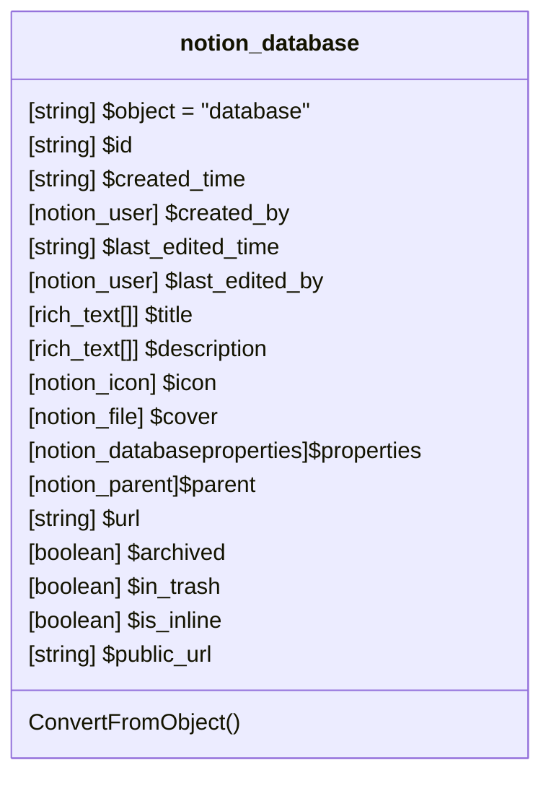

# Database

[API Reference](https://developers.notion.com/reference/database)

## Related Classes

- [notion_user](../User/01_user.md)
- [rich_text](../Block/RichText/01_Rich_Text.md)
- [notion_icon](../General/00_icon.md)
- [notion_file](../File/01_file.md)
- [notion_parent](../Parent/00_parent.md)
- [notion_databaseproperties](./DatabaseProperties/01_dp.md)
