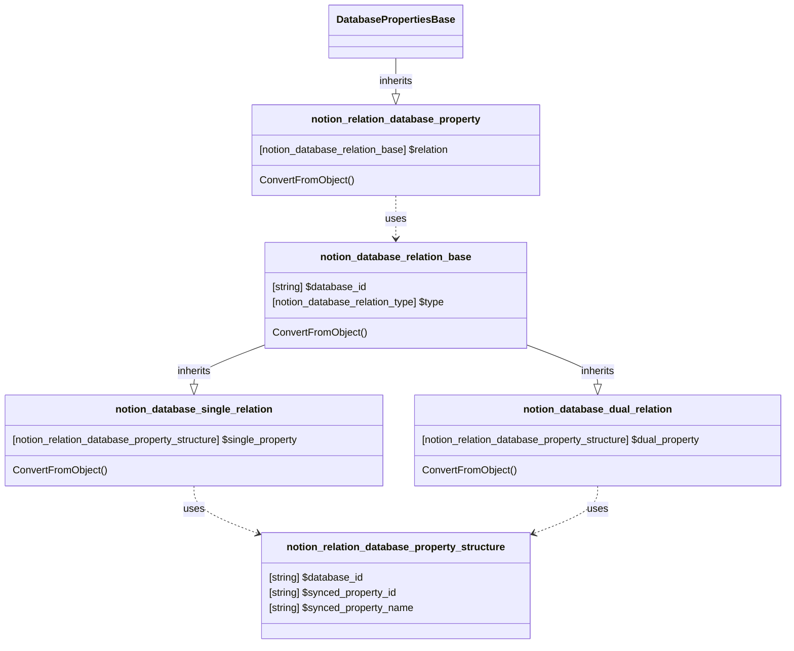

# DatabaseProperty: Relation

[API Reference](https://developers.notion.com/reference/page-property-values#relation)

## Related Classes

- [DatabasePropertiesBase](./00_dp_DatabasePropertiesBase.md)
