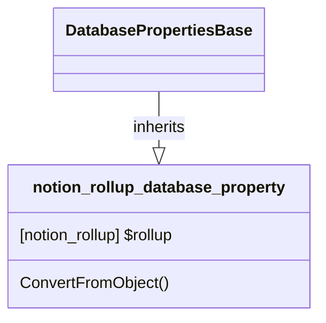

# DatabaseProperty: Rollup

[API Reference](https://developers.notion.com/reference/property-object#rollup)

## Related Objects

- [DatabasePropertiesBase](./00_dp_DatabasePropertiesBase.md)
- [notion_rollup](../../General/17_rollup.md)
