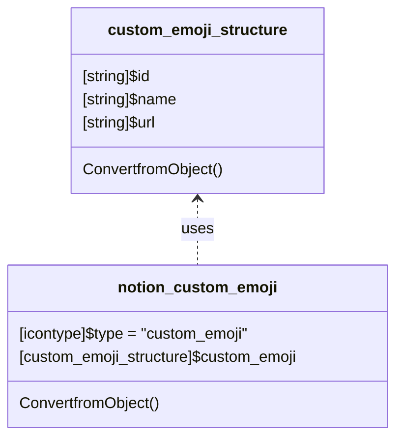

# Emoji: Custom_emoji

[API Reference](https://developers.notion.com/reference/emoji-object#custom-emoji)

```mermaid
classDiagram
    class custom_emoji_structure {
        [string]$id
        [string]$name
        [string]$url
        ConvertfromObject()
    }   
    class notion_custom_emoji {
        [icontype]$type = "custom_emoji"
        [custom_emoji_structure]$custom_emoji
        ConvertfromObject()
    }

    `custom_emoji_structure` <.. `notion_custom_emoji`:uses
```
