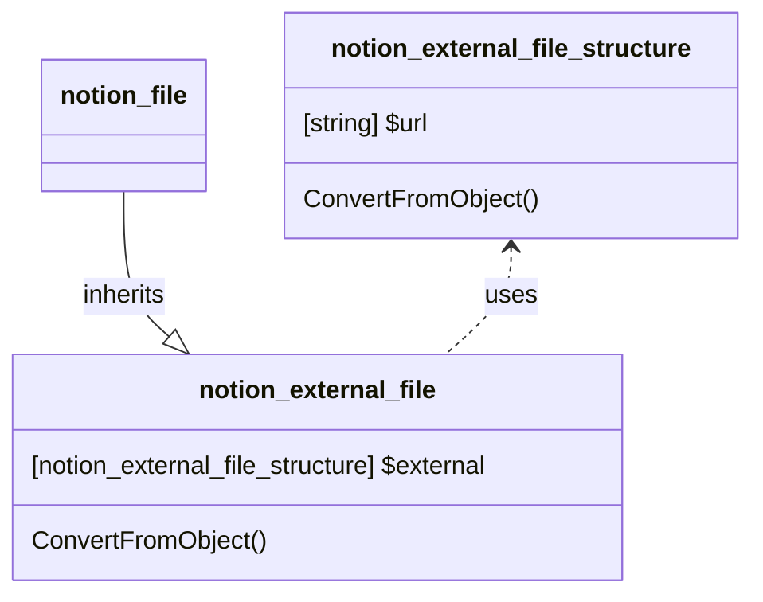

# File: External_file

[API Reference](https://developers.notion.com/reference/file-object#external-files)

```mermaid
classDiagram
    class notion_external_file_structure {
        [string] $url
        ConvertFromObject()
    }

    class notion_external_file {
        [notion_external_file_structure] $external
        ConvertFromObject()
    }
    `notion_file` --|> `notion_external_file`:inherits
    `notion_external_file_structure` <.. `notion_external_file`:uses
```

## Related Classes

- [notion_file](./01_file.md)
