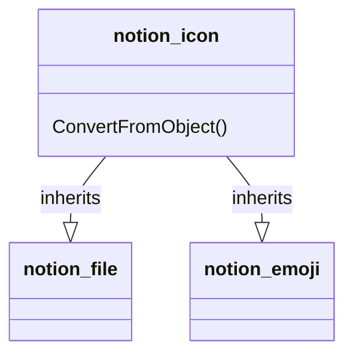

# PageProperty: Icon

[API Reference Page Property](https://developers.notion.com/reference/page-property-values#icon)
[API Reference Database](https://developers.notion.com/reference/database)

## Related Classes

- [notion_icon](../General/00_icon.md)
