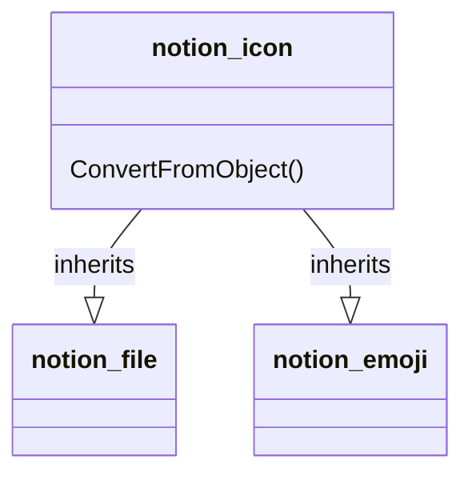

# PageProperty: Icon

[API Reference](https://developers.notion.com/reference/page-property-values#icon)

```mermaid
classDiagram
    class notion_icon {
        ConvertFromObject()
    }
    `notion_icon` --|> `notion_file`:inherits
    `notion_icon` --|> `notion_emoji`:inherits
```

## Related Classes

- [notion_icon](../General/00_icon.md)
