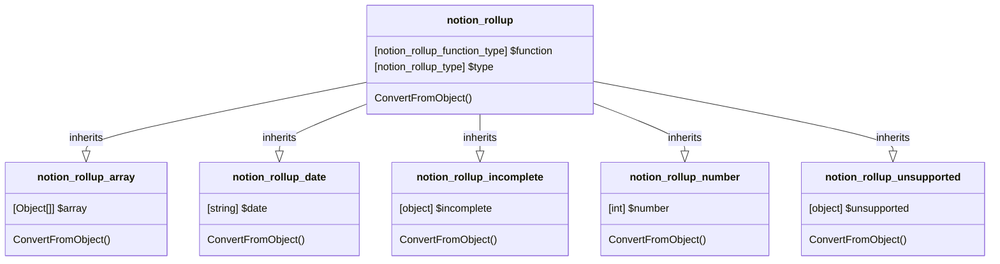

# PageProperty: Rollup

[API Reference](https://developers.notion.com/reference/page-property-values#rollup)

```mermaid
classDiagram
    class notion_rollup{
        [notion_rollup_function_type] $function
        [notion_rollup_type] $type
        ConvertFromObject()
    }

    class notion_rollup_array {
        [Object[]] $array
        ConvertFromObject()
    }

    class notion_rollup_date {
        [string] $date
        ConvertFromObject()
    }

    class notion_rollup_incomplete {
        [object] $incomplete
        ConvertFromObject()
    }

    class notion_rollup_number {
        [int] $number
        ConvertFromObject()
    }

    class notion_rollup_unsupported {
        [object] $unsupported
        ConvertFromObject()
    }
    `notion_rollup` --|> `notion_rollup_array`:inherits
    `notion_rollup` --|> `notion_rollup_date`:inherits
    `notion_rollup` --|> `notion_rollup_incomplete`:inherits
    `notion_rollup` --|> `notion_rollup_number`:inherits
    `notion_rollup` --|> `notion_rollup_unsupported`:inherits
```
