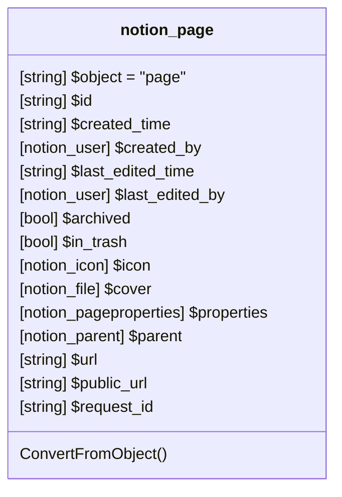

# Page

[API Reference](https://developers.notion.com/reference/page)

```mermaid
classDiagram
    class notion_page {
        [string]     $object = "page"
        [string]     $id
        [string]     $created_time
        [notion_user]       $created_by
        [string]     $last_edited_time
        [notion_user]       $last_edited_by
        [bool]       $archived
        [bool]       $in_trash
        [notion_icon]      $icon
        [notion_file]    $cover
        [notion_pageproperties] $properties
        [notion_parent]    $parent
        [string]     $url
        [string]     $public_url
        [string]     $request_id
        ConvertFromObject()
    }
```
