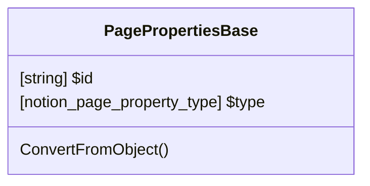

# PageProperty: Base

[API Reference](https://developers.notion.com/reference/page-property-values)

```mermaid
classDiagram
    class PagePropertiesBase {
        [string] $id
        [notion_page_property_type] $type
        ConvertFromObject()
    }
```
