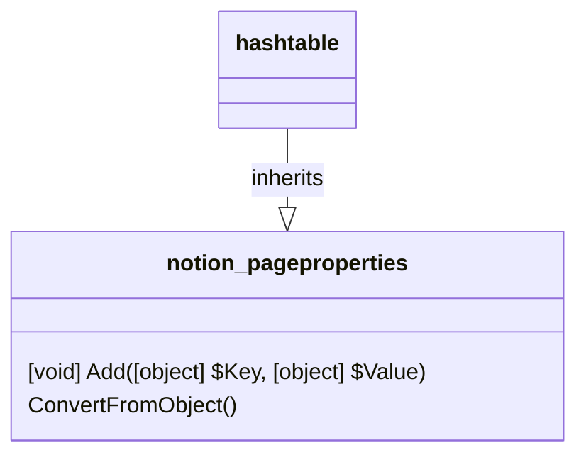

# PageProperty

[API Reference](https://developers.notion.com/reference/page-property-values)

The page properties have a name, which is the key and a value, which is the actual property. This matches the built-in functionality of a hashtable, therefore the database properties are derived from the class Hashtable.

## PageProperties

* [pp_checkbox](./02_pp_checkbox.md)
* [pp_created_by](./03_pp_created_by.md)
* [pp_created_time](./04_pp_created_time.md)
* [pp_date](./05_pp_date.md)
* [pp_email](./07_pp_email.md)
* [pp_files](./08_pp_files.md)
* [pp_formula](./09_pp_formula.md)
* [pp_icon](../../General/00_icon.md)
* [pp_last_edited_by](./10_pp_last_edited_by.md)
* [pp_last_edited_time](./11_pp_last_edited_time.md)
* [pp_multi_select](./12_pp_multi_select.md)
* [pp_number](./13_pp_number.md)
* [pp_people](./14_pp_people.md)
* [pp_phone_number](./15_pp_phone_number.md)
* [pp_relation](./16_pp_relation.md)
* [pp_rollup](./17_pp_rollup.md)
* [pp_rich_text](./18_pp_rich_text.md)
* [pp_select](./19_pp_select.md)
* [pp_status](./20_pp_status.md)
* [pp_title](./21_pp_title.md)
* [pp_url](./22_pp_url.md)
* [pp_unique_id](./23_pp_unique_id.md)
* [pp_verification](./24_pp_verification.md)
