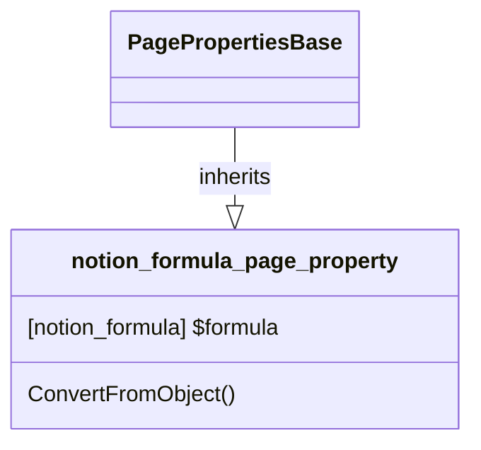

# PageProperty: Formula

[API Reference](https://developers.notion.com/reference/page-property-values#formula)

## Related Classes

- [PagePropertiesBase](./00_pp_base.md)
- [notion_formula](../../General/09_formula.md) 
