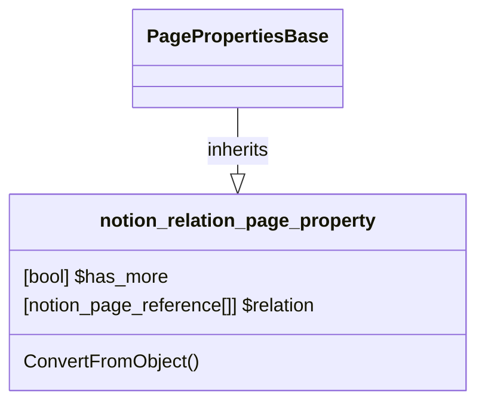

# PageProperty: Relation

[API Reference](https://developers.notion.com/reference/page-property-values#relation)

## Related Classes

- [PagePropertiesBase](./00_pp_base.md)
- [notion_page_reference](../../Page/04_page_reference.md)
