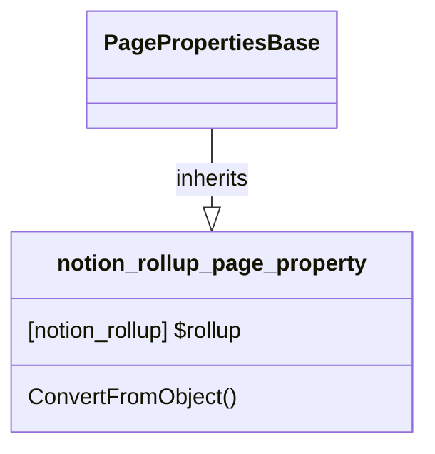

# PageProperty: Rollup

[API Reference](https://developers.notion.com/reference/page-property-values#rollup)

## Related Classes

- [PagePropertiesBase](./00_pp_base.md)
- [notion_rollup](../../General/17_rollup.md)
