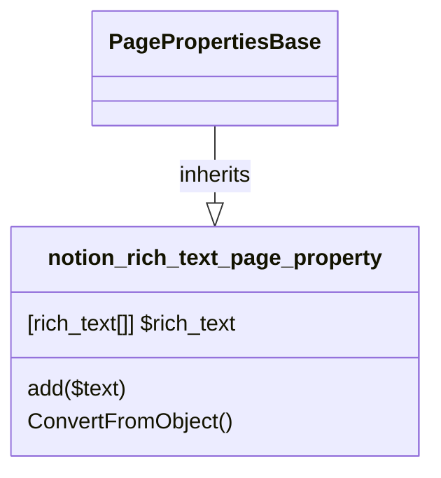

# PageProperty: Rich_text

[API Reference](https://developers.notion.com/reference/page-property-values#rich-text)

## Related Classes

- [PagePropertiesBase](./00_pp_base.md)
- [rich_text ](../../Block/RichText/01_Rich_Text.md)
