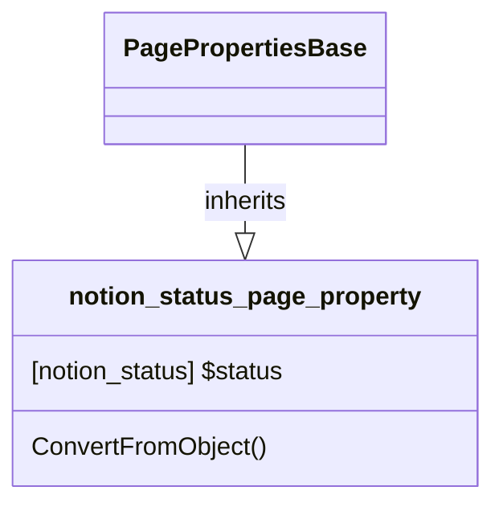

# PageProperty: Status

[API Reference](https://developers.notion.com/reference/page-property-values#status)

## Related Classes

- [PagePropertiesBase](./00_pp_base.md)
- [notion_status](../../General/20_status.md)
