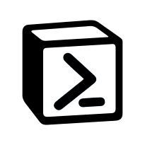
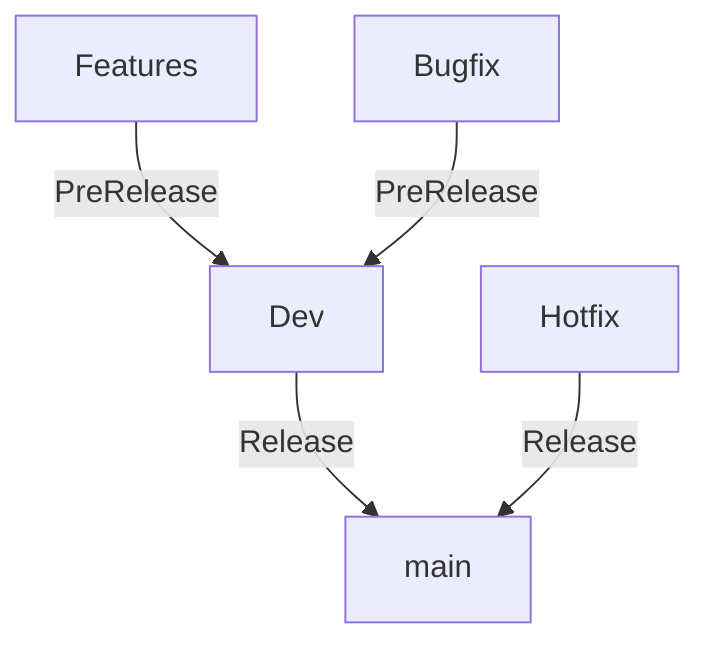

# Notion PowerShell Module

<p align="center">
  
</p>

# Notion - A class-based PowerShell module for interacting with Notion


[](https://www.powershellgallery.com/packages/Notion/)
[](https://www.powershellgallery.com/packages/Notion/)

[](https://github.com/fasteiner/Notion/issues)

&#x26a0; Work in progress - not all features are implemented yet, if you are missing something, or experience any issues, please open an issue on GitHub.

[Notion](https://notion.com), is an online knowledge management tool in which you can structure your requirements yourself or be inspired by countless templates and formats. Unfortunately, there was no PowerShell module that offers the full power of the API.

In order to ensure the smoothest possible interaction with the API, the specifications were implemented with PowerShell classes. This means that classes are used in the background for all cmdlets. You can also create your own Notion objects directly using the classes provided.

## Prerequisites

- PowerShell 7.0 or higher

## Getting started

To get started either:

- Install from the PowerShell Gallery using PowerShellGet by running the
  following command:

```PowerShell
# PowerShellGet 2.x
Install-Module -Name Notion -Repository PSGallery

# PowerShellGet 3.x
Install-PSResource -Name Notion

# Connect to Notion
$BearerToken = Read-Host -Prompt "Enter your Notion Bearer Token" -AsSecureString
Connect-Notion -BearerToken $BearerToken
```

Or download it via the [Microsoft PowerShell Gallery](https://www.powershellgallery.com/packages/Notion)

## Documentation

Documentation is available in the [Wiki](https://github.com/fasteiner/Notion/wiki).

## Issues

Please open a github issue [here](https://github.com/fasteiner/Notion/issues).


## Contributing
# Contributing

Please check out common DSC Community [contributing guidelines](https://dsccommunity.org/guidelines/contributing).

## Running the Tests

If want to know how to run this module's tests you can look at the [Testing Guidelines](https://dsccommunity.org/guidelines/testing-guidelines/#running-tests)

## Branch Model

The branch model is based on the [GitFlow](https://nvie.com/posts/a-successful-git-branching-model/) model.



## GitVersion install

```powershell
    #eventually you need to install the nuget.org source
    #dotnet nuget add source https://api.nuget.org/v3/index.json -n nuget.org

    dotnet tool install --global GitVersion.Tool --version 5.12.0
```

## Manual Build, Import & Connect

```powershell
    # Clone the repository
    #when running the first time you also need to resolve the dependencies
    ./build.ps1 -Tasks build -ResolveDependency -UseModuleFast
    $version = (dotnet-gitversion.exe /showvariable MajorMinorPatch)
    $ModuleFile = ".\output\module\Notion\$version\Notion.psd1"
    Import-Module $ModuleFile
    # Import-Module Microsoft.PowerShell.PlatyPS -Force
    # New-MarkdownCommandHelp -ModuleInfo (Get-Module Notion) -OutputFolder .\docs -WithModulePage -HelpVersion "$version" -Force
    $BearerToken = Read-Host -Prompt "Enter your Notion Bearer Token" -AsSecureString

    Connect-Notion -BearerToken $BearerToken
```


## Wiki
# Welcome to the PowerShell Notion Module Wiki


Here you will find all the information you need to use Notion.

Please leave comments, feature requests and bug reports for this module in
the [issues section](https://github.com/fasteiner/Notion/issues)
of this repository.

Find the FAQs here: [FAQs](Module%20FAQ.md)

## Installation

``` PowerShell
# Install via PowerShellGet 2.x
Install-Module -Name Notion -Repository PSGallery

# Install via PowerShellGet 3.x
Install-PSResource Notion -Repository PSGallery
```
## How to start with this module?

Before you start with connecting to your Notion teamspace, you need to create an integration, which is allowed to interact with your space.

Follow this link to get a detailed instructions how to [create your Notion integration](SetupOfIntegration.md).

## Usage

``` PowerShell
# Import the module
Import-Module -Name Notion

# List all Cmdlets
Get-Command -Module Notion

# List Cmdlets for blocks
Get-Command -Module Notion -Noun NotionBlock

# Connect to Notion (with your integration/bearer token)
$BearerToken = Read-Host -Prompt "Enter your Bearer token" | ConvertTo-Securestring -AsPlainText
Connect-Notion -BearerToken $BearerToken
```


## Idea behind a class based Notion module

There are several attempts to talk to the Notion API out there, but most of them didn't take care of the correct
syntax of the individual configuration of each block/page/database etc. So we decided to create classes for all
available Notion objects presented by the API. (there are some objects which are not available right now -
end of 2024 like e.g. template)

The charm of Notion classes are this simple use while creating objects.

``` PowerShell
[notion_block]::new() # creates an empty block object
[notion_page]::new()  # creates a new page object
[notion_emoji]::new() # creates a new emoji object
```

However, there is also a New-Notion<BlockName>Block CmdLet available to create a new block object.

``` PowerShell
New-NotionBookmarkBlock -URL "https://www.example.com" -Caption "Example Bookmark"
New-NotionCalloutBlock -RichText "This is a callout" -Icon "💡"
New-NotionBreadcrumbBlock #new breadcrumb block
```

If you receive items from the API, the Notion module will automatically convert it into Notion objects
(based on the classes) so that the can be used.

## Notion Objects

There are several type of Notion object for different purposes.

- Block
- Page
- Database
- Parent
- User
- Comment
- Unfurl attribute
- File
- Emoji

Find the classes Documentation here: [Classes Documentation](https://github.com/fasteiner/Notion/tree/main/docs/Classes)

### General used verbs for those objects

#### Nesting of those objects


### General used verbs for objects

- Get     (retrieves an object)
- New     (creates an object without uploading it)
- Add     (adds a new object to another already existing object e.g. a block to a page)
- Update  (modifies an object)
- Remove  (deletes an object)

Each of the objects have got individual CmdLets to deal with.
<div style="display: flex;">

  <table>
  <tr><th>Object: Block</th></tr>
  <tr><td>Add-NotionBlockToPage</td></tr>
  <tr><td>Get-NotionBlock</td></tr>
  <tr><td>Get-NotionBlockChildren</td></tr>
  </table>

  <table>
  <tr><th>Object: Database</th></tr>
  <tr><td>Add-NotionPageToDatabase</td></tr>
  <tr><td>Edit-NotionDatabase</td></tr>
  <tr><td>Get-NotionDatabase</td></tr>
  <tr><td>Move-NotionDatabaseToArchive</td></tr>
  <tr><td>New-NotionDatabase</td></tr>
  <tr><td>Remove-NotionDatabase</td></tr>
  <tr><td>Restore-NotionDatabase</td></tr>
  </table>

  <table>
  <tr><th>Object: DatabaseProperties</th></tr>
  <tr><td>Add-NotionDatabaseProperty</td></tr>
  <tr><td>New-NotionDatabaseProperty</td></tr>
  <tr><td>Remove-NotionDatabaseProperty</td></tr>
  </table>

</div>

<div style="display: flex;">

  <table>
  <tr><th>Object: Page</th></tr>
  <tr><td>Get-NotionPage</td></tr>
  <tr><td>Get-NotionPageChildren</td></tr>
  <tr><td>Move-NotionPageToArchive</td></tr>
  <tr><td>New-NotionPage</td></tr>
  <tr><td>Remove-NotionPage</td></tr>
  <tr><td>Restore-NotionPage</td></tr>
  </table>

  <table>
  <tr><th>Object: PageProperties</th></tr>
  <tr><td>Get-NotionPageProperty</td></tr>
  <tr><td>Update-NotionPageProperty</td></tr>
  </table>
</div>

<div style="display: flex;">

  <table>
  <tr><th>Object: User</th></tr>
  <tr><td>Get-NotionUser</td></tr>
  </table>

</div>

## Classes and Enums

An easy way to generate new blocks is to instantiate them from predefined classes via `[classname]::new()`.
On the querying side the API returns a naked object with properties. The module automatically turns those answers into proper Notion objects (derived from classes)

The enumerations (enums) are predefined values which are valid for a certain properties. e.g. colors

### Enums
- `[notion_rich_text_type]`
- `[notion_blocktype]`
- `[notion_database_property_type]`
- `#[relation_type]`
- `[notion_database_property_format_type]`
- `[notion_filetype]`
- `[notion_page_property_type]`
- `[notion_property_color]`
- `[notion_formula_type]`
- `[notion_rollup_type]`
- `[notion_rollup_function_type]`
- `[notion_page_verification_state]`
- `[notion_parent_type]`
- `[bot_owner_type]`
- `[notion_color]`
- `[notion_icon_type]`
- `[rich_text_mention_type]`
- `[template_mention_date]`

### Classes
- `[notion_annotation]`
- `[notion_heading_1_block]`
- `[notion_heading_2_block]`
- `[notion_heading_3_block]`
- `[notion_block]`
- `[notion_bookmark_block]`
- `[notion_bot_user]`
- `[notion_breadcrumb_block]`
- `[notion_bulleted_list_item_block]`
- `[notion_callout_block]`
- `[notion_checkbox_page_property]`
- `[notion_child_database_block]`
- `[notion_child_page_block]`
- `[notion_code_block]`
- `[notion_column_block]`
- `[notion_column_list_block]`
- `[notion_comment]`
- `[notion_created_by_page_property]`
- `[notion_created_time_page_property]`
- `[notion_custom_emoji]`
- `[notion_database]`
- `[notion_databaseproperties]`
- `[notion_date_page_property]`
- `[notion_divider_block]`
- `[notion_email_page_property]`
- `[notion_embed_block]`
- `[notion_emoji]`
- `[notion_equation_block]`
- `[notion_external_file]`
- `[notion_file]`
- `[notion_file_block]`
- `[notion_files_page_property]`
- `[notion_formula_page_property]`
- `[notion_hosted_file]`
- `[notion_image_block]`
- `[notion_last_edited_by_page_property]`
- `[notion_last_edited_time_page_property]`
- `[notion_link_preview_block]`
- `[notion_multi_select_item]`
- `[notion_multi_select_page_property]`
- `[notion_number_page_property]`
- `[notion_numbered_list_item_block]`
- `[notion_page]`
- `[notion_icon]`
- `[notion_page_parent]`
- `[notion_pageproperties]`
- `[notion_paragraph_block]`
- `[notion_parent]`
- `[notion_page_parent]`
- `[notion_workspace_parent]`
- `[notion_PDF_block]`
- `[notion_people_page_property]`
- `[notion_people_user]`
- `[notion_phone_number_page_property]`
- `[notion_quote_block]`
- `[notion_relation_page_property]`
- `[notion_rich_text_page_property]`
- `[notion_rollup_page_property]`
- `[notion_section_unfurl_attribute]`
- `[notion_select_page_property]`
- `[notion_status_page_property]`
- `[notion_sub_type_child_unfurl_attribute]`
- `[notion_sub_type_unfurl_attribute]`
- `[notion_synced_block]`
- `[notion_table_of_contents_block]`
- `[notion_title_page_property]`
- `[notion_to_do_block]`
- `[notion_toggle_block]`
- `[notion_unique_id_page_property]`
- `[notion_url_page_property]`
- `[notion_user]`
- `[notion_verification_page_property]`
- `[notion_video_block]`
- `[rich_text]`
- `[rich_text_equation]`
- `[rich_text_equation_structure]`
- `[rich_text_mention]`
- `[rich_text_mention_base]`
- `[rich_text_mention_database]`
- `[rich_text_mention_database_structure]`
- `[rich_text_mention_date]`
- `[rich_text_mention_date_structure]`
- `[rich_text_mention_link_preview]`
- `[rich_text_mention_page]`
- `[rich_text_mention_page_structure]`
- `[rich_text_mention_template_mention]`
- `[rich_text_mention_template_mention_structure_base]`
- `[rich_text_mention_template_mention_template_mention_date_structure]`
- `[rich_text_mention_template_mention_template_mention_user_structure]`
- `[rich_text_mention_user]`
- `[rich_text_text]`
- `[rich_text_text_structure]`

## Change log

A full list of changes in each version can be found in the [change log](https://github.com/fasteiner/Notion/blob/main/CHANGELOG.md).


## Changes
# Changelog for Notion

The format is based on and uses the types of changes according to [Keep a Changelog](https://keepachangelog.com/en/1.0.0/),
and this project adheres to [Semantic Versioning](https://semver.org/spec/v2.0.0.html).

## [Unreleased]

## [0.8.0] - 2025-06-23

### Added

- **source/Classes/Block/RichText/01_Rich_Text.ps1**
  - Added Factory method `::Create` to instantiate `notion_rich_text` objects from various input types.
  - Added prototype of `ConvertFromMarkdown` method to convert Markdown text to `notion_rich_text` objects.
- **source/Classes/Parent/00_parent.ps1**
  - Added Recommended Action for unknown parent types in the `ConvertFromObject` method.
- **source/Public/Block/Code/New-NotionCodeBlock.ps1**
  - Added Aliases for `text`: `code`, `content`, for better flexibility in block creation.
- **source/Public/Block/_RichText/New-NotionRichText.ps1**
  - Included Possibility to pass a Markdown via `-MarkdownText`
- **source/Public/Emoji/New-NotionEmoji.ps1**
  - Added new function to create `notion_emoji` objects from strings.
- **tests/Integration/Block/callout.tests.ps1**
  - Added integration tests for `New-NotionCalloutBlock` cmdlet, covering various scenarios and rich text handling.
- New Unit Tests for several classes: 
  - `tests/Unit/Classes/Emoji/Custom_Emoji.Tests.ps1`
  - `tests/Unit/Classes/Emoji/Emoji.Tests.ps1`
  - `tests/Unit/Classes/Page/PageProperties/pp_checkbox.Tests.ps1`
  - `tests/Unit/Classes/Parent/parent.Tests.ps1`
  - `tests/Unit/Classes/User/user.Tests.ps1`
- New Unit Tests for several functions:
  - `tests/Unit/Public/Block/Callout/New-NotionCalloutBlock.Tests.ps1`
  - `tests/Unit/Public/Emoji/New-NotionEmoji.Tests.ps1`

### Changed

- renamed `icon_type` to `notion_icon_type`

### Fixed

- **source/Classes/Block/05_Bookmark.ps1**
  - Corrected constructors to (remove call to base class constructor)
- **source/Classes/Block/RichText/Type/01_Rich_text_text.ps1**
  - Fixed `ConvertFromObject` in main class and structure class to handle both string and object inputs correctly, ensuring robust rich text handling.
  - Also fix href handling in the constructor to ensure it is set correctly when provided.
- **source/Classes/Emoji/02_Custom_Emoji.ps1**
  - hardcoded the `type` property to `custom_emoji` in the constructor, as it is required by the Notion API.
- **source/Public/Block/Callout/New-NotionCalloutBlock.ps1**
  - Switched to object array for `rich_text` parameter to allow multiple rich text objects, improving flexibility in block creation.
- **source/Public/Block/_RichText/New-NotionRichText.ps1**
  - Fixed conversion of rich_text, by passing it as an object to `[rich_text]::ConvertFromObjects`, ensuring consistent handling of rich text objects.
- **source/Public/Parent/New-NotionParent.ps1**
  - Switched to factory method `::Create` to ensure the conversion logic is handled by the class itself, improving consistency and maintainability. Also initalize the id to an empty string if not provided, to ensure the object is always in a valid state and can be created without errors.

### Removed

- **source/Classes/Block/RichText/Type/03_Rich_text_equation.ps1**
  - Duplicate constructor with one parameter removed, PowerShell does not support this syntax.

### Deprecated

- **source/Public/Block/LinkPreview/New-NotionLinkPreviewBlock.ps1**
  - Deprecated `New-NotionLinkPreviewBlock` cmdlet, as the Notion API does not support creating link preview blocks directly.
  - Added a error message to inform users about the deprecation.

## [0.7.0] - 2025-06-19

### Added

- **.gitignore**
  - Added rules to exclude diff files (`*.diff`, `diff.*`) from version control.
- **source/Classes/Parent/00_parent.ps1**
  - Created Factory method `::new` to instantiate `notion_parent` objects from various input types.
- **source/Public/Parent/New-NotionParent.ps1**
  - New function to create `parent` objects (`page_id`, `database_id`, `block_id`, `wordspace`)
- **source/Private/Remove-NullValuesFromObject.ps1**
  - Added docs
- **source/Private/Test-NotionApiSettings.ps1**
  - New function to validate Notion API settings, ensuring `NotionApiKey`, `NotionApiUri` and `NotionApiVersion` are set.
- **source/Public/File/New-NotionFile.ps1**
  - New function to create `notion_file` objects, supporting various file types and rich text captions.
- **source/Public/Page/Get-NotionPage.ps1**
  - Added `-Raw` parameter to return raw JSON data from the Notion API, allowing for more flexible data handling.
  - Added check of API Parameters to ensure `NotionApiKey`, `NotionApiUri`, and `NotionApiVersion` are set before making API calls.
- **tests/Unit/Classes/00_General/00_icon.tests.ps1**
  - Added unit tests for `notion_icon` class, covering various input types and conversion methods.

### Changed

- **.vscode/profile.ps1**
  - Simplified directory change logic to always set location to the Notion module path.

- **.vscode/settings.json**
  - Removed custom terminal profile definition for Linux (`Notion pwsh`), likely to simplify or standardize terminal configurations.

- **build.ps1**
  - Simplified `gitversion` alias creation by unconditionally defining the alias to `dotnet-gitversion`, removing conditional logic.

- **source/Classes/03_File/01_notion_file.ps1**
  - Refactored `ConvertFromObject` logic to simplify type checking and error handling.
  - Removed unimplemented `file_upload` type handling.

- **source/Classes/03_File/03_external_file.ps1**
  - Removed redundant constructor that accepted only a URL, consolidating object creation pathways.

- **source/Public/Block/_RichText/New-NotionRichText.ps1**
  - Use handling in [richt_text] instead of maintaining separate logic in the cmdlet.

- **source/Public/Page/Get-NotionPageChildren.ps1**
  - Added connectivity check

### Fixed

- **source/Classes/00_General/00_icon.ps1**
  - Fixed `ConvertFromObject` to handle both string and object inputs correctly, ensuring robust icon handling.
  - Created factory method (::new) to instantiate `notion_icon` objects from various input types.
- **source/Classes/03_File/01_file.ps1**
  - Handle caption correctly in `ConvertFromObject`, ensuring its only processed if present.
- **source/Classes/03_File/02_hosted_file.ps1**
  - Added Constructor with two parameters: `url` and `expiry_time`, to support creation without caption and name.
  - Ensure the rich_text is converted correctly using `[rich_text]::ConvertFromObjects` for consistent rich text handling.
- **source/Classes/03_File/03_external_file.ps1**
  - Fixed `ConvertFromObject` to handle both string and object inputs correctly, ensuring robust external file handling.
  - Ensure rich_text is converted correctly using `[rich_text]::ConvertFromObjects` for consistent rich text handling.
- **source/Classes/Block/RichText/01_Rich_Text.ps1**
  - Fixed `ConvertFromObjects` to handle empty strings correctly (no conversion), and allow Object and
- **source/Public/Page/New-NotionPage.ps1**
  - Fixed `Icon` and `Cover` property handling
- **source/Private/Remove-NullValuesFromObject.ps1**
  - Fixed handling of empty strings and arrays only containing empty strings, ensuring they are removed from the object.

- **source/Public/Block/Paragraph/New-NotionParagraphBlock.ps1**
  - Fixed parameter handling, added example documentation

## [0.6.0] - 2025-06-16

### Added

- **Development Environment**
  - `.devcontainer/devcontainer.json`: Added VS Code extensions `github.vscode-github-actions` and `shd101wyy.markdown-preview-enhanced` for enhanced GitHub workflow and markdown preview.
  - `.vscode/extensions.json`: Added the same extensions to the recommended list.

- **Documentation and Site Generation**
  - `.github/templates/README.template.md`: Introduced a new README template that dynamically includes `README.md`, `CONTRIBUTING.md`, the Wiki homepage, and `CHANGELOG.md`.
  - `.github/workflows/generate-project-page.yml`: Created GitHub Actions workflow to deploy a Jekyll-based project page from a feature branch using `peaceiris/actions-gh-pages`.
  - `GemFile`: Added dependencies: `jekyll`, `minima`, `csv`, `logger`, `base64`.
  - `jekyll_config.yml`: Defined Jekyll site configuration including theme and SEO plugin.

### Changed

- **README and Assets**
  - `README.md`: Replaced deprecated `<center>` tag with `<p align="center">`, and updated image path.
  - `TSNotion_mini.png`: Moved to `assets/TSNotion_mini.png` for better organisation.

- **Development Environment Settings**
  - `.vscode/profile.ps1`: Removed conditional directory check to always set working location to the Notion module path.
  - `.vscode/settings.json`: Removed Linux terminal profile configuration and associated settings.

- **Build Script Behavior**
  - `build.ps1`: Simplified alias setup to always define `gitversion` for `dotnet-gitversion`.
  - `build.yaml`: Added `Create_ChangeLog_GitHub_PR` task to `publish` stage to write version number in `CHANGELOG.md` from latest GitHub release tag.

- **Class Definitions**
  - `source/Classes/03_File/01_notion_file.ps1`: Removed unsupported `"file_upload"` case from `Create` and `ConvertFromObject`.
  - `source/Classes/03_File/03_external_file.ps1`: Removed unused constructor for `notion_external_file` that only accepted a URL.

- **Block Type Handling**
  - `source/Classes/Block/04_Block.ps1`: Removed early return if input was already a `notion_block`.

- **Paragraph Block Structure**
  - `source/Classes/Block/23_Paragraph.ps1`: Removed constructors with `color` as second argument; simplified initialization.

- **PDF Block Structure**
  - `source/Classes/Block/24_PDF.ps1`: Refactored to use a new `PDF_structure` class, enabling rich text captions and stronger type safety.

- **Quote Block Structure**
  - `source/Classes/Block/25_Quote.ps1`: Simplified constructors and improved parsing in `ConvertFromObject` using rich text conversion.

- **Synced Block Structure**
  - `source/Classes/Block/26_Synced_Block.ps1`: Removed `Synced_Block_Duplicate_structure` class; streamlined synced block logic.

- **Table Row Logic**
  - `source/Classes/Block/27.2_TableRow.ps1`: Simplified cell-adding logic using direct `ForEach` with cleaner checks.

- **Table of Contents Block**
  - `source/Classes/Block/30_Table_Of_Contents.ps1`: Cleaned up constructor logic and enum parsing.

- **To-do Block Structure**
  - `source/Classes/Block/31_To_do.ps1`: Switched to `ForEach` for rich text and clarified argument handling.

- **Toggle Block Structure**
  - `source/Classes/Block/32_Toggle.ps1`: Rewrote constructors for better type clarity and streamlined text conversion.

## [0.5.0] - 2025-06-15

### Added

- **VSCode Configuration**
  - `.vscode/settings.json`: Configured `terminal.integrated.bracketedPasteMode`, disabled minimap, custom terminal profile, formatter preferences, and extension settings.
  - `.vscode/profile.ps1`: PowerShell profile to auto-import the module during VSCode sessions.
  - `.vscode/vsicons-custom-icons/`: Support for custom icons, including `file_type_pester.svg` and `copyFileToSystemPath.ps1`.

- **Build and Wiki Scripts**
  - `.build/Copy-WikiContent.ps1`: Script to copy wiki content from source to destination with flattened structure.
  - `.build/New-WikiSidebarFromPs1.ps1`: Generates `_Sidebar.md` from PowerShell and Markdown files.
  - `.build/README.md`: Documentation for adding custom build tasks and workflows.
  - `build.yaml`: Added `minibuild` task with steps for `Clean`, `Build_Module_ModuleBuilder`, and `Build_NestedModules_ModuleBuilder`.

- **Module Source Code**
  - `source/Classes/03_File/01_notion_file.ps1`: Static `Create` method to instantiate child objects based on file type.
  - `source/Classes/Block/RichText/01_Rich_Text.ps1`: `ConvertFromObjects` method to convert arrays or single objects into `rich_text[]`.
  - Various block classes (`Bookmark`, `Callout`, `ChildPage`, `Code`, `Image`, `Video`, etc.): New or refactored constructors, support for flexible input, `ConvertFromObject(s)` methods, support for `caption`, emoji, etc.
  - `source/Classes/Block/04_Block.ps1`: Improved error messages for unsupported and unknown block types with GitHub issue link.
  - `source/Classes/Emoji/01_emoji.ps1`: `ConvertFromObject` method to handle strings and emoji objects.
  - `source/Public/Block/New-NotionBlock.ps1`: Generic factory function to create Notion blocks.
  - `source/Public/Block/Cmds/*`: Many new cmdlets like `New-NotionBookmarkBlock`, `New-NotionCalloutBlock`, etc.
  - `docs/Enums/`: Markdown documentation for all enums used in the module.
  - `source/WikiSource/`: Wiki source files including setup guide, FAQ, and integration images.

- **Tests**
  - `tests/Integration/Block/testpage.tests.ps1`: Improved logic and error message validation.
  - `tests/Integration/PageProperties/testpage.tests.ps1`: Validation for page property types.
  - `tests/Unit/Classes/Block/`: Unit tests for many block classes.
  - Additional tests for new constructors, block types, and unsupported block error messages.

### Changed

- **General Refactoring**
  - Refactored many constructors across block classes to support more flexible input and consistent use of `ConvertFromObjects`.
  - `source/Classes/Emoji/01_emoji.ps1`: Improved emoji conversion logic.
  - `source/Enum/*`: Added missing enum values and documentation links.

- **Configuration Files**
  - `.vscode/analyzersettings.psd1`: Relaxed some analyzer rules (e.g., allowed `Write-Host`).
  - `.github/ISSUE_TEMPLATE/`: Updated templates to reflect support for cmdlets, classes, and enums.
  - `README.md`: Added badges, logo, and improved getting started section.
  - `RequiredModules.psd1`: Switched to Pester Version 6.
  - `build.ps1`: Added tasks `Generate_Wiki_Sidebar_From_Ps1` and `Copy_Wiki_Content_Custom`.

### Fixed

- **Class Fixes**
  - `source/Enum/01_notion_color.ps1`: Added `default_background` color.
  - `source/Classes/Block/32_Toggle.ps1`: Fixed class name and constructor.
  - `source/Classes/Block/33_Video.ps1`: Fixed constructors and file instantiation logic.
  - `source/Classes/Block/05_Bookmark.ps1`: Fixed constructors and `bookmark_structure` logic.
  - `source/Classes/Block/07_Bulleted_List_Item.ps1`: Fixed `rich_text` conversion in constructors.
  - `source/Classes/Block/08_Callout.ps1`: Fixed constructors and emoji handling.
  - `source/Classes/Emoji/01_emoji.ps1`: Fixed `ConvertFromObject` to handle strings and emoji objects.

- **Tests and Validation**
  - Improved error handling and validation in integration tests.
  - Enhanced input validation to prevent runtime errors.
  - Fixed `ConvertTo-Json` depth handling for complete serialization.
  - Fixed enum handling and added missing values.

## [0.3.0] - 2025-05-18

### Fixed

- Fix Wiki Sidebar
- Fix Logo in ReadMe

## [0.2.0] - 2025-05-18

### Added

- Documentation to Classes: Comment, Emoji, File, General, Page, Parent, User
- Documentation to Classes: Block, Database, DatabaseProperties
- Documentation to Classes: add relation between classes, in dedicated docs folder
- Documentation to all PSCmdlets
- prepared automatic Wiki Generation
- Add-NotionPageToDatabase, Move-NotionPageToArchive: prepared
- Get-NotionPageProperty: prepared and partly tested
- Update-NotionPageProperty: prepared
- Add-NotionDatabaseProperty, Remove-NotionDatabaseProperty, Move-NotionPageToArchive: prepared
- Add-NotionBlockToPage: prepared
- Get-NotionPageChildren: implemented
- Remove-NotionBlock: function to remove / trash a block
- Update-NotionBlock: function to update a block
- New-NotionTable: function to create a new table
- New-NotionTableRow: function to create a new table row

### Changed

- Module Manifest: Added Metadata
- Filenames: changed to match the cmdlet names
- ConvertTo-NotionObject: include property_item
- Disconnect-Notion: improve Confirm message
- Restore-NotionPage, Restore-NotionDatabase: add archived = $false, to ensure restore is possible from both trash and archive
- For changes in existing functionality.
- Remove-NotionPage: specify output type, fix code
- Get-NotionBlockChildren: refactored

### Removed

- page, Get-NotionPage: remove children
- TableCell: was only a wrongly implemented wrapper for rich_text

### Fixed

- Add-NotionHeaderToBlock: fix parameter types
- New-NotionHeader: switch to factory method of notion_heading_block
- block: fix ConvertFrom-Object
- Column List: fix ConvertFrom-Object
- Numbered List item: Fix constructors and color conversion to enum
- paragraph: added color in ConvertFrom-Object
- to_do: Fixed ConvertFrom-Object, added default constructor
- Heading: Adjusted implementation to match API Schema
- Remove-NullValuesFromObject: fix DateTime objects and remove empty arrays, include handling for nested arrays
- notion_table_block: implemented according to API Schema
- notion_table_row_block: implemented according to API Schema
- rich_text_text: handle primitive types correctly

### Security

- API Variables: switch from global to script scope

