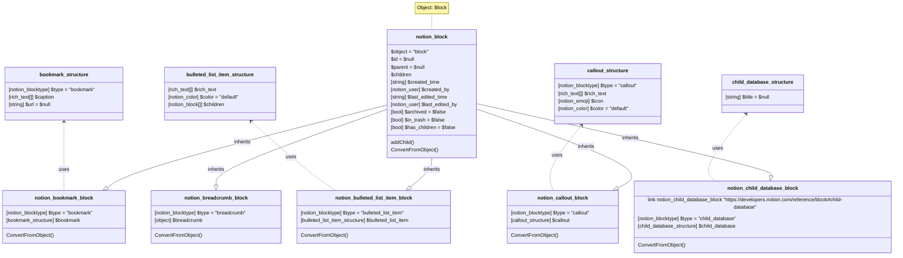

 # Class Block

```mermaid

classDiagram
    note for notion_block "Object: Block"
    class notion_block {
        $object = "block"
        $id =  $null
        $parent =  $null
        $children
        [string] $created_time
        [notion_user] $created_by
        [string] $last_edited_time
        [notion_user] $last_edited_by
        [bool] $archived =  $false
        [bool] $in_trash =  $false
        [bool] $has_children =  $false
        addChild()
        ConvertFromObject()
    }
   

   class bookmark_structure{
        [notion_blocktype] $type = "bookmark"
        [rich_text[]] $caption
        [string] $url = $null
   }

    class notion_bookmark_block {
        [notion_blocktype] $type = "bookmark"
        [bookmark_structure] $bookmark
        ConvertFromObject()
    }
    `bookmark_structure` <.. `notion_bookmark_block`:uses
    `notion_block` --|> `notion_bookmark_block`:inherits

    class notion_breadcrumb_block {
        [notion_blocktype] $type = "breadcrumb"
        [object] $breadcrumb 
        ConvertFromObject()
    }
    `notion_block` --|> `notion_breadcrumb_block`:inherits

    class bulleted_list_item_structure {
        [rich_text[]] $rich_text
        [notion_color] $color = "default"
        [notion_block[]] $children
    }

    class notion_bulleted_list_item_block {
        [notion_blocktype] $type = "bulleted_list_item"
        [bulleted_list_item_structure] $bulleted_list_item
        ConvertFromObject()
    }
    `bulleted_list_item_structure` <.. `notion_bulleted_list_item_block`:uses
    `notion_block` --|> `notion_bulleted_list_item_block`:inherits

    class callout_structure {
        [notion_blocktype] $type = "callout"
        [rich_text[]] $rich_text
        [notion_emoji] $icon
        [notion_color] $color = "default"
    }

class notion_callout_block {
    [notion_blocktype] $type = "callout"
    [callout_structure] $callout
    ConvertFromObject()
}
`callout_structure` <.. `notion_callout_block`:uses
`notion_block` --|> `notion_callout_block`:inherits

class child_database_structure {
    [string] $title = $null
}

class notion_child_database_block {
    link notion_child_database_block "https://developers.notion.com/reference/block#child-database"
    [notion_blocktype] $type = "child_database"
    [child_database_structure] $child_database
    ConvertFromObject()
}
`child_database_structure` <.. `notion_child_database_block`:uses
`notion_block` --|> `notion_child_database_block`:inherits


```
