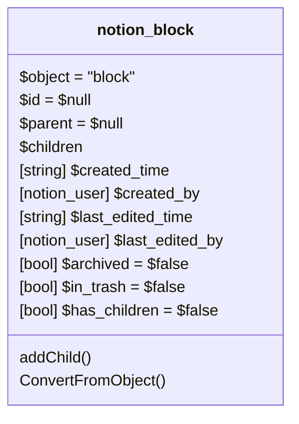
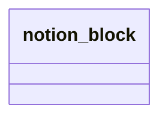

# Block: Block

[API Reference](https://developers.notion.com/reference/block)

## Derived blocks

Other block types are inherited from the generic block.

Within these blocks a inheritance will only visible as class element without all properties.

