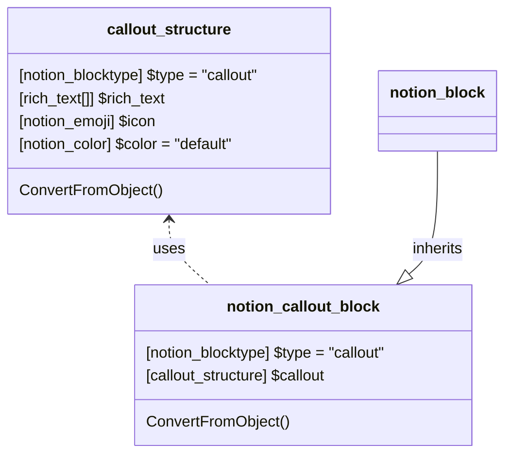

# Block: Callout

[API reference](https://developers.notion.com/reference/block#callout)
# Block: 

[API reference]()

```mermaid
classDiagram
    class callout_structure {
            [notion_blocktype] $type = "callout"
            [rich_text[]] $rich_text
            [notion_emoji] $icon
            [notion_color] $color = "default"
            ConvertFromObject()
        }

    class notion_callout_block {
        [notion_blocktype] $type = "callout"
        [callout_structure] $callout
        ConvertFromObject()
    }
    `callout_structure` <.. `notion_callout_block`:uses
    `notion_block` --|> `notion_callout_block`:inherits
```
