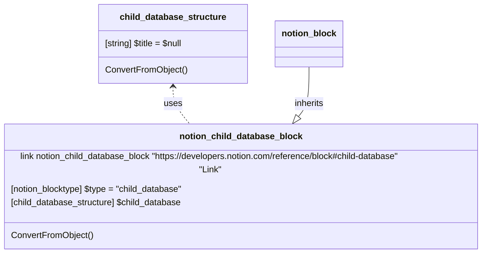

# Block:Child_database

[API Reference](https://developers.notion.com/reference/block#child-database)

```mermaid
classDiagram
    class child_database_structure {
        [string] $title = $null
        ConvertFromObject()
    }

    class notion_child_database_block {
        link notion_child_database_block "https://developers.notion.com/reference/block#child-database" "Link"
        [notion_blocktype] $type = "child_database"
        [child_database_structure] $child_database
        ConvertFromObject()
    }
    `child_database_structure` <.. `notion_child_database_block`:uses
    `notion_block` --|> `notion_child_database_block`:inherits
```
