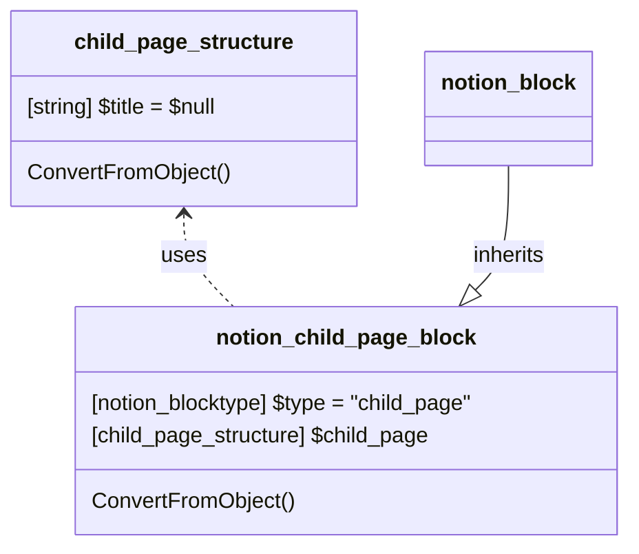

# Block: Child_page

[API reference](https://developers.notion.com/reference/block#child-page)

```mermaid
classDiagram
    class child_page_structure {
        [string] $title = $null
        ConvertFromObject()
    }

    class notion_child_page_block {
        [notion_blocktype] $type = "child_page"
        [child_page_structure] $child_page
        ConvertFromObject()
    }
    `child_page_structure` <.. `notion_child_page_block`:uses
    `notion_block` --|> `notion_child_page_block`:inherits
```
