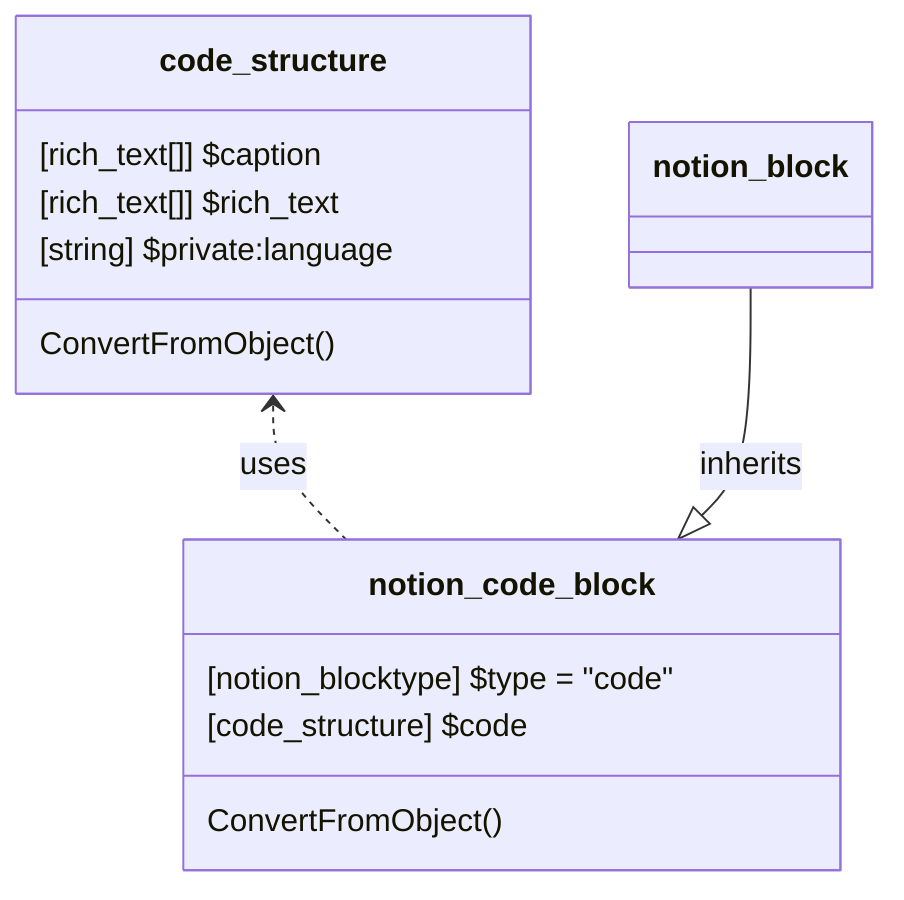

# Block: Code

[API reference](https://developers.notion.com/reference/block#code)

```mermaid
classDiagram
    class code_structure {
        [rich_text[]] $caption
        [rich_text[]] $rich_text
        [string] $private:language
        ConvertFromObject()
    }

    class notion_code_block {
        [notion_blocktype] $type = "code"
        [code_structure] $code
        ConvertFromObject()
    }
    `code_structure` <.. `notion_code_block`:uses
    `notion_block` --|> `notion_code_block`:inherits
```
