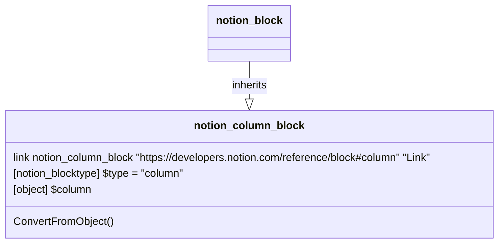

# Block: Column

[API reference](# https://developers.notion.com/reference/block#column)

```mermaid
classDiagram
    class notion_column_block {
        link  notion_column_block "https://developers.notion.com/reference/block#column" "Link"
        [notion_blocktype] $type = "column"
        [object] $column
        ConvertFromObject()
    }
    `notion_block` --|> `notion_column_block`:inherits
```
