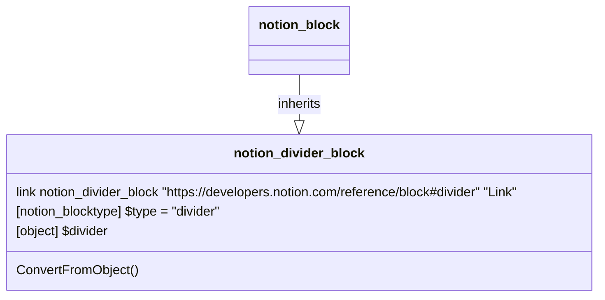

# Block: Divider

[API reference]()

```mermaid
classDiagram
    class notion_divider_block {
        link notion_divider_block "https://developers.notion.com/reference/block#divider" "Link"
        [notion_blocktype] $type = "divider"
        [object] $divider
        ConvertFromObject()
    }
    `notion_block` --|> `notion_divider_block`:inherits
```
