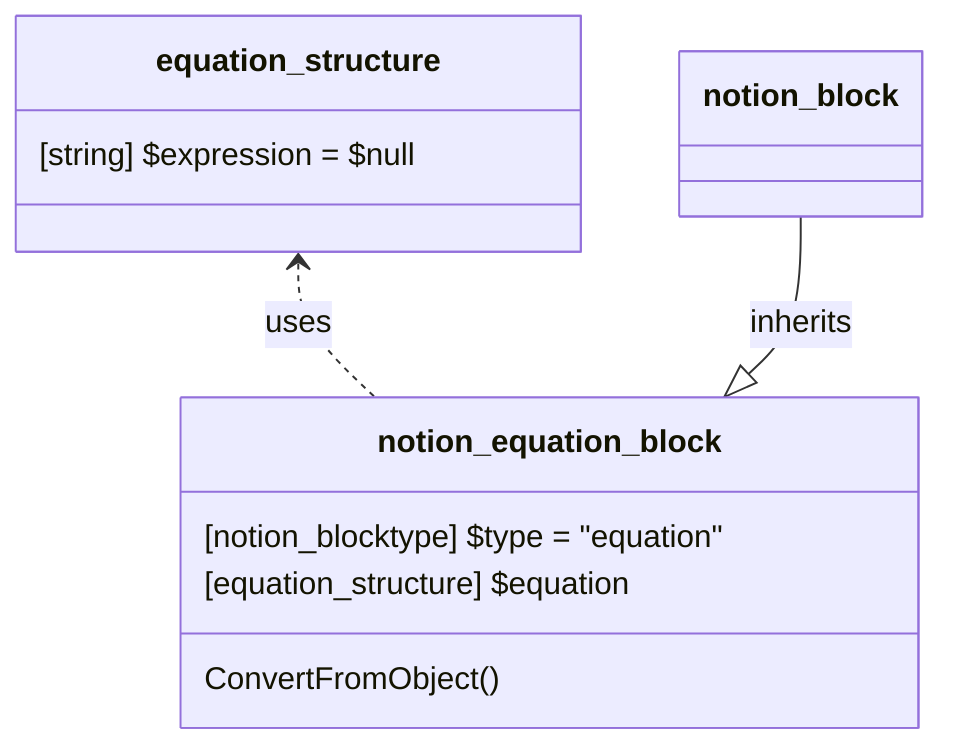

# Block: Equation

[API reference](https://developers.notion.com/reference/block#equation)

```mermaid
classDiagram
    class equation_structure {
        [string] $expression = $null
    }
    
    class notion_equation_block {
        [notion_blocktype] $type = "equation"
        [equation_structure] $equation
        ConvertFromObject()
    }
    `equation_structure` <.. `notion_equation_block`:uses
    `notion_block` --|> `notion_equation_block`:inherits
```
