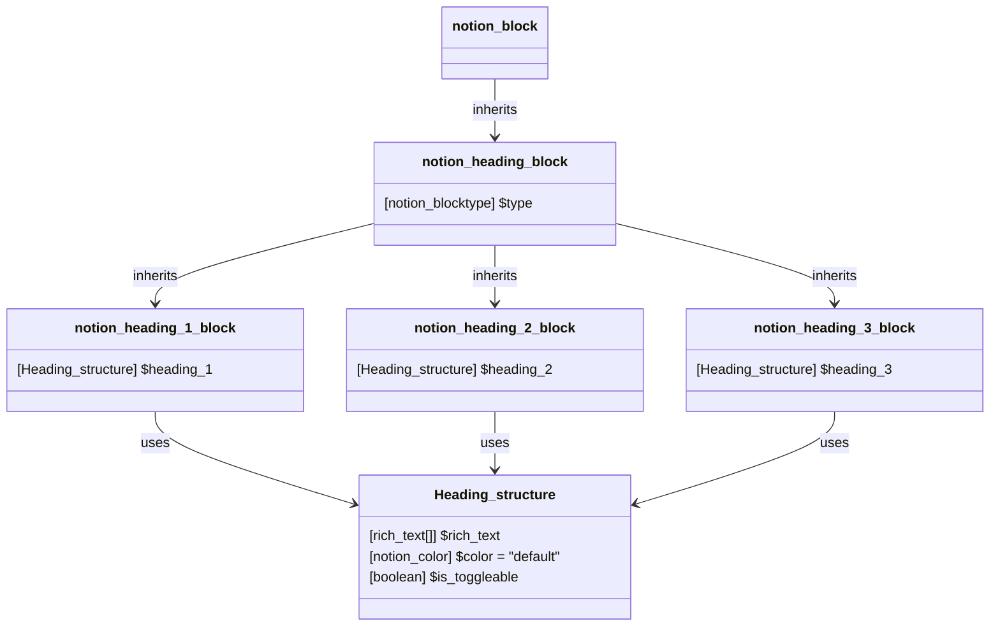

# Block: Heading

[API reference](https://developers.notion.com/reference/block#headings)

```mermaid
classDiagram
    class Heading_structure {
        [rich_text[]] $rich_text
        [notion_color] $color = "default"
        [boolean] $is_toggleable
    }

    class notion_heading_block {
        [notion_blocktype] $type
    }

    class notion_heading_1_block {
        [Heading_structure] $heading_1
    }
    class notion_heading_2_block {
        [Heading_structure] $heading_2
    }
    
    class notion_heading_3_block {
        [Heading_structure] $heading_3
    }
    notion_block --> notion_heading_block:inherits
    notion_heading_block --> notion_heading_1_block:inherits
    notion_heading_block --> notion_heading_2_block:inherits
    notion_heading_block --> notion_heading_3_block:inherits
    notion_heading_1_block --> Heading_structure:uses
    notion_heading_2_block --> Heading_structure:uses
    notion_heading_3_block --> Heading_structure:uses
```
