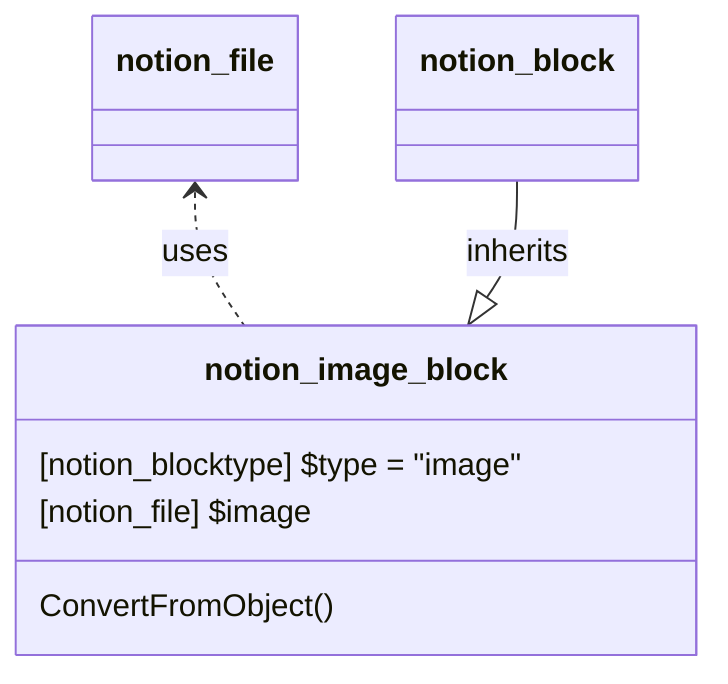

# Block: Image

[API reference](https://developers.notion.com/reference/block#image)

```mermaid
classDiagram
    class notion_image_block {
        [notion_blocktype] $type = "image"
        [notion_file] $image
        ConvertFromObject()
    }

    `notion_file` <.. `notion_image_block`:uses
    `notion_block` --|> `notion_image_block`:inherits
```
